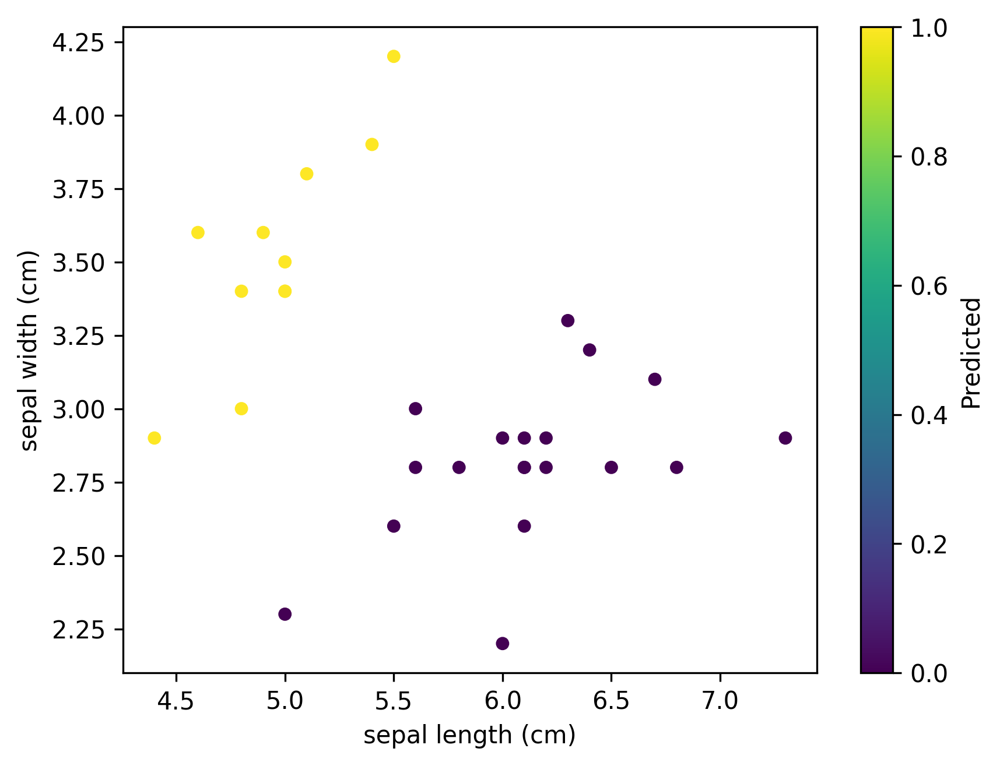

🌸 Perceptron Classifier on Iris Dataset
A simple implementation of the Perceptron algorithm to classify Iris flowers using the first two features of the classic Iris dataset. This project demonstrates binary classification, model evaluation, and visualization using Python and foundational machine learning concepts.
📌 Project Overview
This project implements a custom Perceptron from scratch using NumPy and applies it to a binary classification task: distinguishing Iris Setosa from other Iris species. It includes:
- Manual implementation of the Perceptron learning algorithm
- Training and evaluation on a subset of the Iris dataset
- Visualization of predictions using a scatter plot
- Generation of a classification report for performance metrics
🧠 Algorithm
The Perceptron is a linear classifier that updates weights based on prediction error. It uses a step activation function and learns through iterative weight updates over multiple epochs.
Key Components:
- fit(X, y): Trains the model using input features and labels
- predict(x): Predicts the class label for a given input
- _activation_function(z): Applies a binary threshold to the weighted sum
📊 Dataset
- Source: sklearn.datasets.load_iris
- Features used: sepal length (cm) and sepal width (cm)
- Target transformation: Binary classification (Iris Setosa vs. Others)
📈 Results
- Model trained for 100 epochs with a learning rate of 0.1
- Classification report includes precision, recall, and F1-score
- Scatter plot visualizes predicted labels on the test set

🛠 Dependencies
Make sure to install the following Python packages:
pip install numpy pandas matplotlib scikit-learn

🚀 How to Run
- Clone the repository or copy the script.
- Run the Python file using:
python perceptron_iris.py

- The classification report will be printed in the console.
- A scatter plot image (perceptron-iris-predictions.png) will be saved in the working directory.
📚 Learnings- Hands-on understanding of Perceptron mechanics
- Importance of feature selection and target transformation
- Visual interpretation of model predictions
🙌 Acknowledgments- Scikit-learn for the Iris dataset and evaluation tools
- Inspired by foundational machine learning tutorials and coursework
