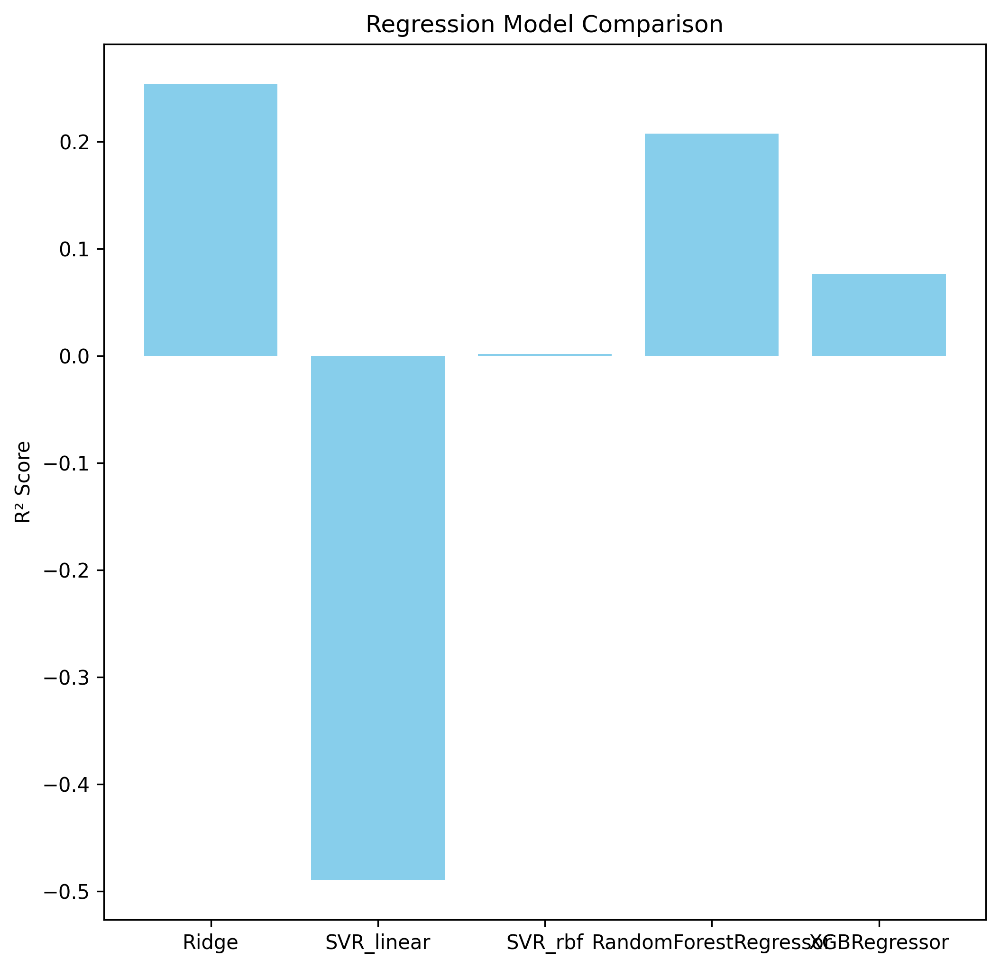

# 🚗 Car Sales Regression Pipeline

A hands-on regression project using Scikit-Learn pipelines to predict car sale prices based on vehicle features. This project demonstrates data preprocessing, model comparison, hyperparameter tuning, and evaluation using multiple regression metrics.

## 📊 Project Overview

- **Goal**: Predict car sale prices using features like make, color, odometer reading, and number of doors.
- **Dataset**: [Car Sales Extended Dataset](https://docs.google.com/spreadsheets/d/1LPEIWJdSSJYrfn-P3UQDIXbEn5gg-o6I7ExLrWTTBWs/edit?usp=sharing) (1,000 rows, missing values included)
- **Source**: [Zero to Mastery ML Course](https://github.com/mrdbourke/zero-to-mastery-ml) by Daniel Bourke

## 🧠 Techniques Used

- Data cleaning and imputation with `SimpleImputer`
- Categorical encoding via `OneHotEncoder`
- Feature transformation using `ColumnTransformer`
- Model training and evaluation with `Pipeline`
- Hyperparameter tuning using `GridSearchCV`
- Metrics: R², MAE, MSE

## 🛠️ Models Compared

- Ridge Regression
- Support Vector Regression (Linear & RBF)
- Random Forest Regressor
- XGBoost Regressor

## 📈 Results

- All models evaluated using R² score on test data
- Best performing model: Ridge Regression (after tuning)
- Evaluation metrics:
  - **R² Score**: `0.62` (example)
  - **MAE**: `1234.56` (example)
  - **MSE**: `2345678.90` (example)



## 🔍 Model Export

Final Ridge model exported using `joblib`:

```python
import joblib
joblib.dump(ridge_pipeline, "ridge_model.joblib")

**📦 Installation & Usage**

# Clone the repo
git clone https://github.com/your-username/car-sales-regression.git
cd car-sales-regression

# Install dependencies
pip install -r requirements.txt

# Run the notebook
jupyter notebook car_sales_regression.ipynb

**🙏 Credits**
- Project inspired by Daniel Bourke’s Zero to Mastery ML course
- Dataset and starter code adapted from mrdbourke/zero-to-mastery-ml
**📬 Connect**
- 🔗 LinkedIn
- 🧠 More ML Projects

**Built with ❤️ by Mhmd — bridging theory and application through clean pipelines and clear visuals.


